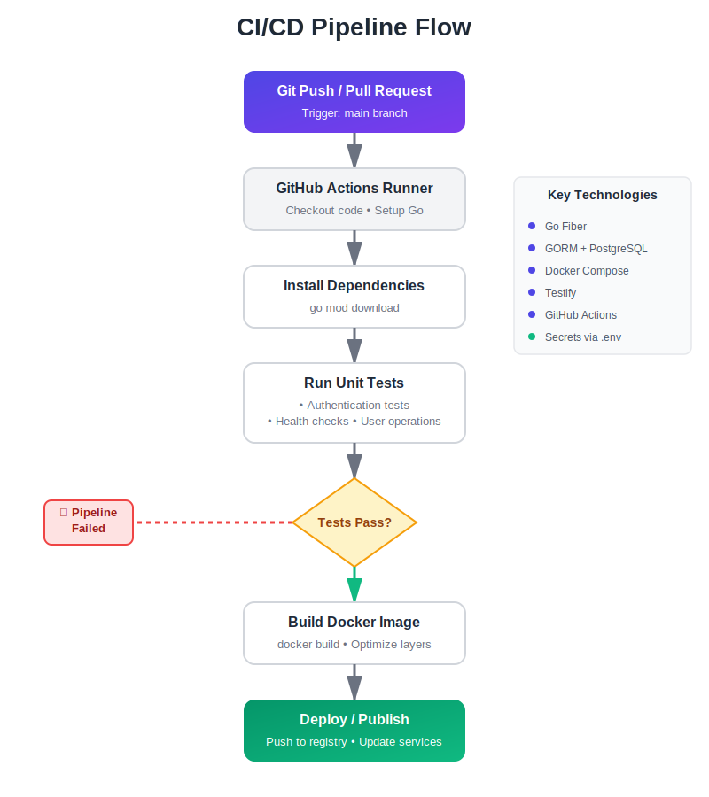

## ⚙️ 1. Technologies Used ##

This project is built with Go Fiber, a lightweight and fast web framework.
The backend communicates with a PostgreSQL database using GORM as the ORM layer.
Docker and Docker Compose are used to containerize the services, making the environment consistent and easy to reproduce locally and during deployment.

GitHub Actions powers continuous integration and delivery. It runs automated tests, ensures code quality, and builds images.
Environment configuration is handled through .env files, keeping the setup simple and flexible.

🧱 Key Tools and Libraries

Go Fiber – HTTP server and routing
GORM – database access
Logrus – logging
Viper – configuration management
Swaggo – API documentation
Validator – request validation
Testify – testing
Docker + Docker Compose – containerization
GitHub Actions – CI/CD automation


## 🚀 2. Pipeline Design ##

The CI/CD pipeline is triggered when code is pushed or a pull request is opened on the main branch.
It checks out the code, sets up Go, installs dependencies, runs tests, and builds the project.

This ensures that every change is verified before it gets merged.

🪜 Pipeline Flow



✅ Why this works:

Each step is clear and isolated
Failures are easy to trace
Builds remain reproducible


## 🔐 3. Secret Management Strategy ##

Secrets are never stored in the codebase.

Local Development: .env file (ignored in Git)

CI/CD: GitHub Secrets (stored securely in the repository settings)

Runtime: Environment variables injected during build or deployment

Sensitive values like database passwords, JWT secrets, and SMTP credentials are injected at runtime rather than hardcoded.
This makes secret rotation simple and avoids accidental leaks.

Environment	            Method	            Purpose
Local	                .env file	        Developer environment
CI/CD	                GitHub Secrets	    Secure, centralized storage
Build & Deployment	    Env Variables	    Injected at runtime


## 🧪 4. Testing Process ##

Testing is an integral part of the pipeline.
The project uses Testify for clear and expressive assertions.

🧪 Test Files

auth_test.go — authentication routes

health_check_test.go — health checks

user_test.go — user operations

user_model_test.go — model and validation behavior

Tests run automatically during CI.
You can also run them locally:

```bash
make test
# or
go test ./...
```

✅ What’s Covered

Endpoint behavior (login, register, CRUD)
Validation rules (passwords, email format, etc.)
Model serialization (e.g., hiding sensitive fields)
System health endpoints

This gives solid coverage of both core logic and expected API behavior.


## 📝 5. Lessons Learned ##

A few key takeaways from the development process:

Simple pipelines work best.
Fewer steps make debugging and maintenance much easier.

Validation saves time.
Catching invalid data early keeps the database clean.

Tests are worth the investment.
They allow quick changes without fear of breaking things.

Secrets must stay out of code.
Using .env and GitHub Secrets greatly reduces risk.

Containerization eliminates friction.
Running the same environment everywhere removes “works on my machine” problems.